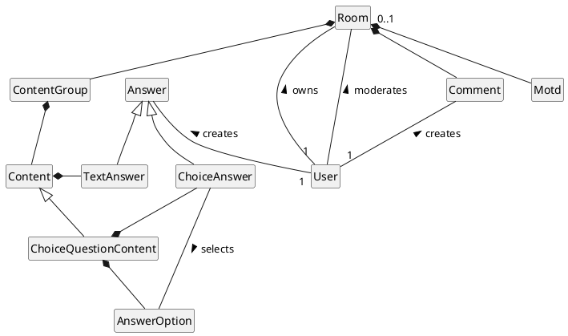

# Domain

## Model

Please note: This is a domain diagram and its purpose is to give a quick overview of the relations between entity classes.
The concrete implementation differs and most relations use indirect references via IDs or indexes.

## Entities
* `Room`s are key to access and organize data for a group of participants.
  Most entities are directly or indirectly related to a room.
  While the denotation "room" is consistently used for code,
  "session" is used in some legacy APIs and might also be used in clients for GUI labels.
* `Comment`s store short texts written by participants of a room.
* `ContentGroup`s are used to classify a group of contents (e.g. by topic or date) for a room.
* `Content`s are used to provide text content for participants in a specific format.
  In case of `ChoiceQuestionContent` content is in the form of a question with predefined `AnswerOption`s.
* `Answer`s store a text (`TextAnswer`) or selected options (`ChoiceAnswer`) as a reaction from a participant to a content.
* `Motd`s (Messages of the Day) store informational texts for a specific room or the whole ARSnova instance.
